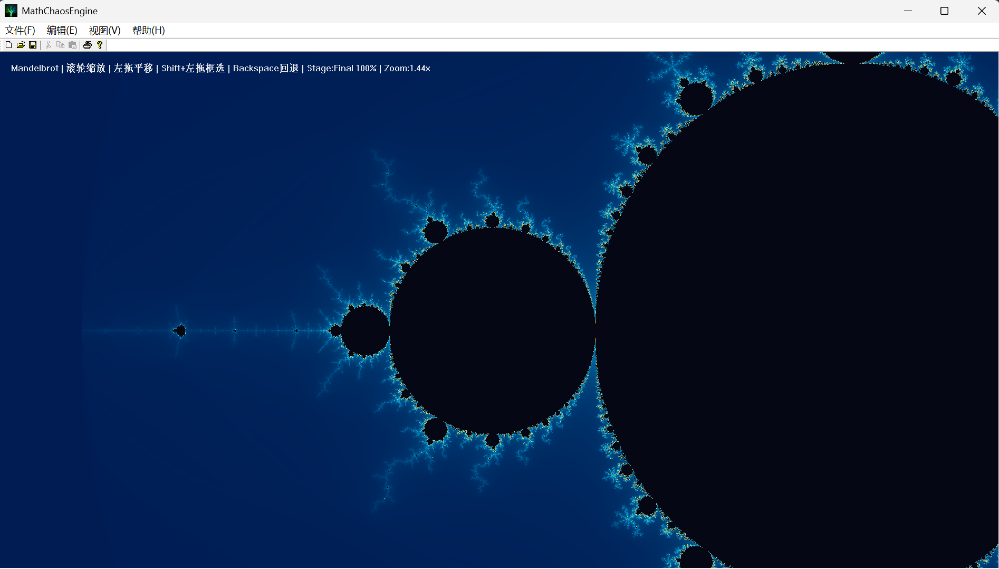
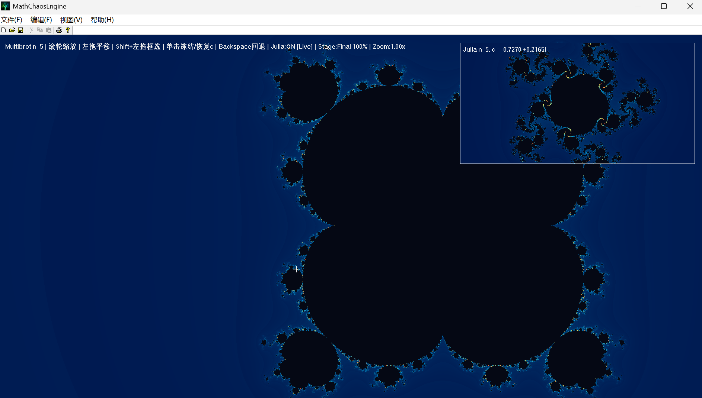
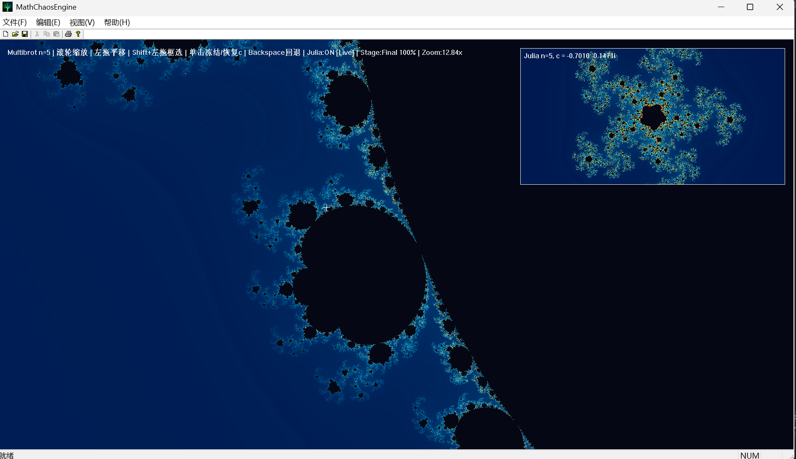
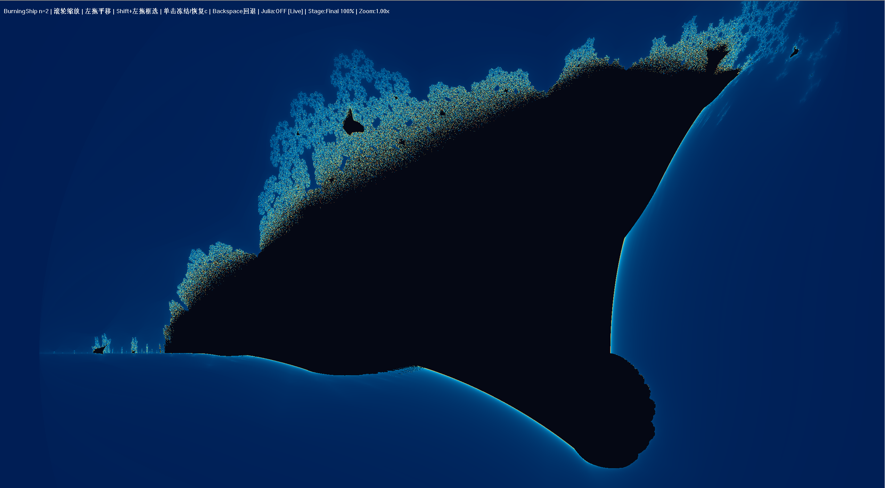
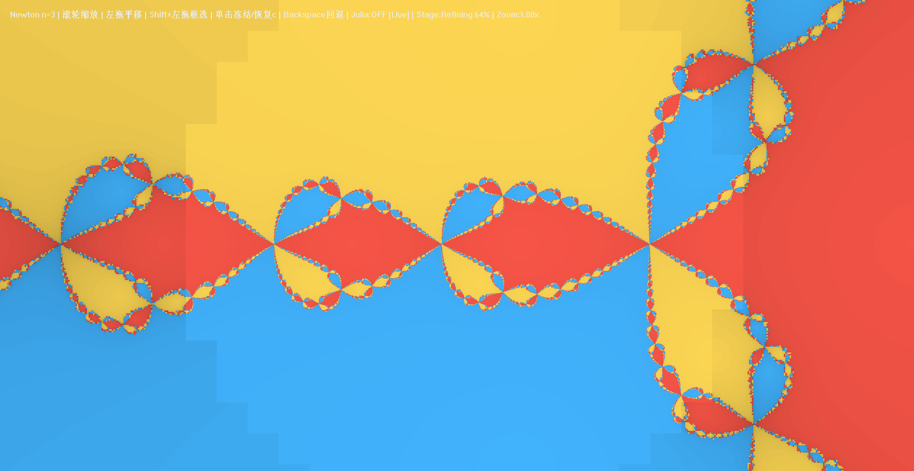
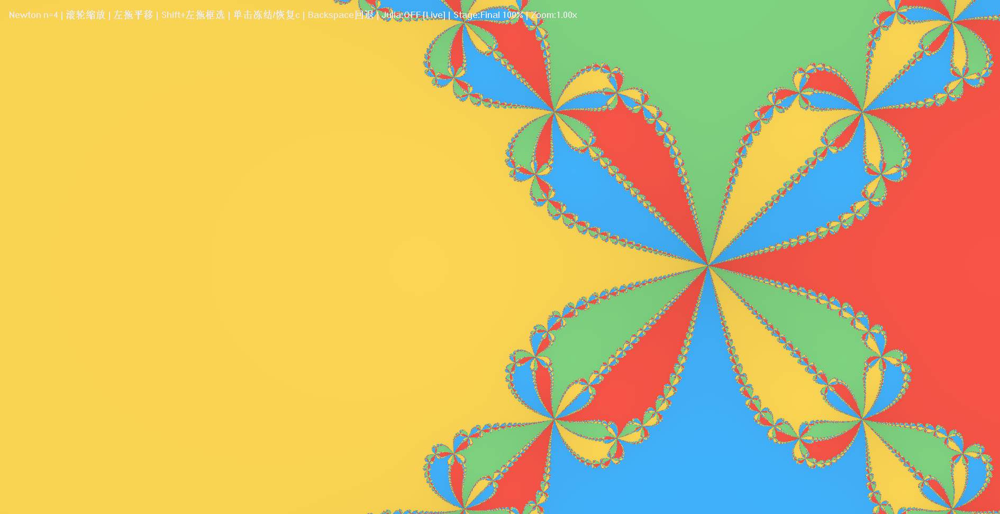
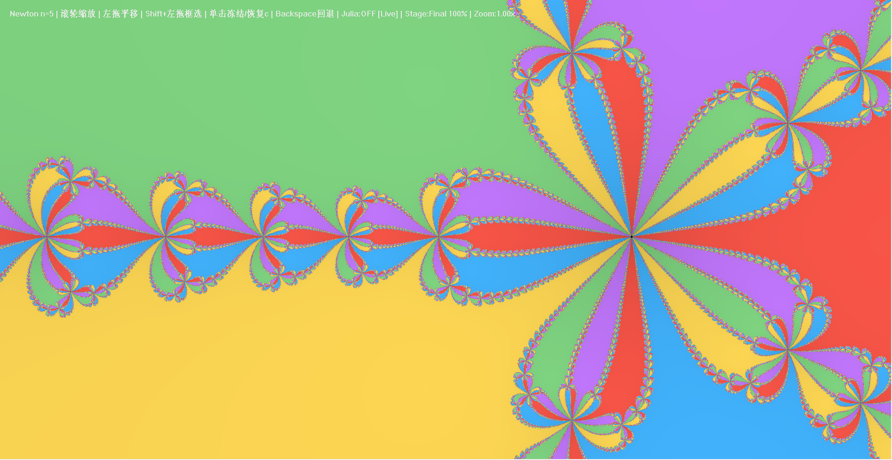

# MathChaosEngine

A lightweight mathematical visualization engine built with VS2022 + MFC.

MathChaosEngine explores the beauty of mathematics through fractals, chaos systems, and generative visuals.

---

## Preview

---

## Current Features

- Fractal Tree module (animated growth, random style variants)
- Progressive Mandelbrot Explorer (`Preview -> Refining -> Final`)
- Julia linked preview window (live/frozen `c` modes)
- Multibrot (`z^n + c`, `n=2/3/4/5`)
- Burning Ship fractal family
- Newton Fractal (`z^n - 1 = 0`, configurable degree)
- Palette system: Scientific / Neon / Monochrome
- Quality presets: Fast / Balanced / Detail
- Double-buffered GDI rendering with DIB blit pipeline

---

## Interaction (Mandelbrot Scene)

- Mouse wheel: zoom around cursor
- Left drag: pan
- `Shift + Left drag`: box zoom
- Left click (main fractal): freeze/unfreeze Julia `c` sample
- `Backspace`: go back in history
- Right-click menu:
  - Fractal family (`Multibrot / Burning Ship / Newton`)
  - Power `n` presets (`2 / 3 / 4 / 5`)
  - Palette, quality, reset/home/back, Julia link/freeze toggles

### Julia Panel Interaction

- Drag to pan
- Mouse wheel to zoom
- `Shift + Left drag` for box zoom
- Independent exploration while linked to main scene settings

---

## Planned Next Modules

- Lorenz Attractor
- Logistic bifurcation map
- Particle Life Simulation
- Reaction-Diffusion

---

## Tech Highlights

- MFC `CDC` custom renderer
- Progressive tile-based fractal rendering
- Time-budgeted update loop for responsive interaction
- Shared fractal configuration across main view and Julia panel
- Extensible module architecture (`Module`, `Engine`)

---

## Build and Run

1. Open `MathChaosEngine.sln` in Visual Studio 2022.
2. Select `Debug|x64` or `Release|x64`.
3. Build and run.

If build fails with `LNK1104` on `MathChaosEngine.exe`, close any running instance of the app and rebuild.

---

## Release

Download from: [Releases](../../releases)

---

## Author

**nci1496**  
GitHub: [https://github.com/nci1496](https://github.com/nci1496)

---

## About

This project is an exploration of mathematical art and interactive visualization with MFC.

For other MFC projects, visit: [MFC-Mini-Billiards](https://github.com/nci1496/MFC-Mini-Billiards)

---

## License

For educational and demonstration purposes.
