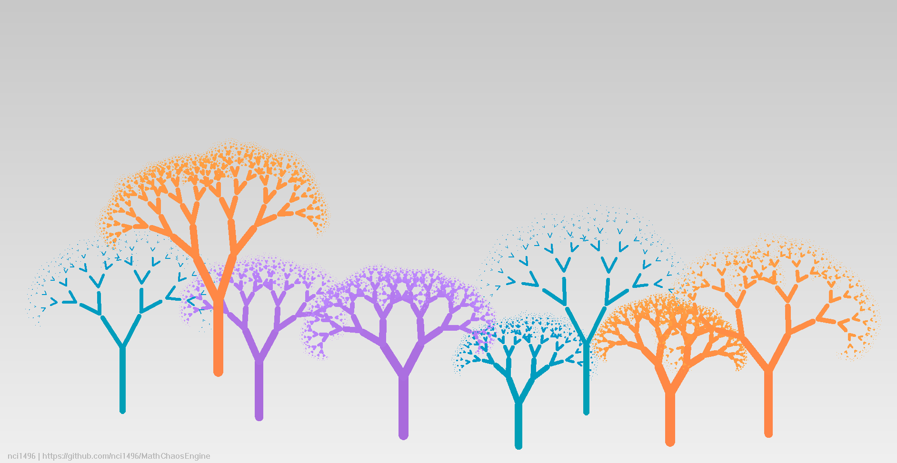
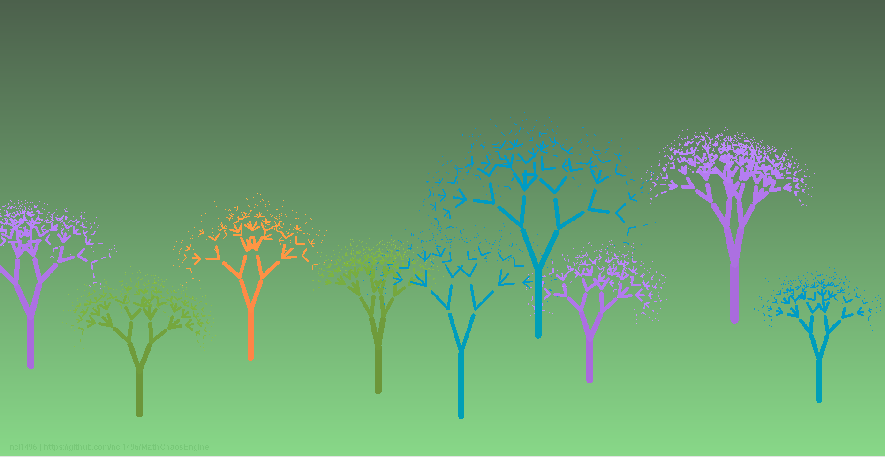

# MathChaosEngine

A lightweight visualization engine for mathematical chaos and generative systems, built with MFC.

This project aims to explore the beauty of mathematics through real-time rendering of fractals, chaotic systems, and particle-based simulations.

---

## 🖼️ Preview

---

## ✨ Features

- Fractal Tree (animated growth)
- Dynamic gradient background with breathing effect
- Real-time rendering using double buffering
- Modular design for multiple mathematical systems

---

## 🚧 Planned Modules

The engine is designed to support multiple mathematical visualizations:

- 🌳 Fractal Tree ✅ (implemented)
- 🌀 Julia Set
- 🔵 Mandelbrot Set
- 🦋 Lorenz Attractor
- 🌌 Particle Life Simulation

---

## 🎮 Interaction

(Current version)

- Automatic animation and rendering
- Visual mode switching (based on tree configuration)

---

## 🧠 Technical Highlights

- Custom rendering pipeline using MFC `CDC`
- Double buffering to eliminate flickering
- Procedural generation of fractal structures
- Time-based animation (growth & breathing effects)
- Color mapping system for depth and progression

---

## 🚀 How to Run

1. Download the latest version from the **Releases** page
2. Run the executable

> No installation required.

---

## 📦 Release

👉 Download here:  
[Releases](../../releases)

---

## 👤 Author

**nci1496**  
GitHub: [nci1496 · Github](https://github.com/nci1496)

---

## 💡 About

- This project is part of an exploration into mathematical visualization and generative art, combining programming, mathematics, and visual design.
  
- For other MFC applications, please visit the website [nci1496|MFC-Mini-Billiards](https://github.com/nci1496/MFC-Mini-Billiards)
  

---

## 📝 License

For educational and demonstration purposes.
